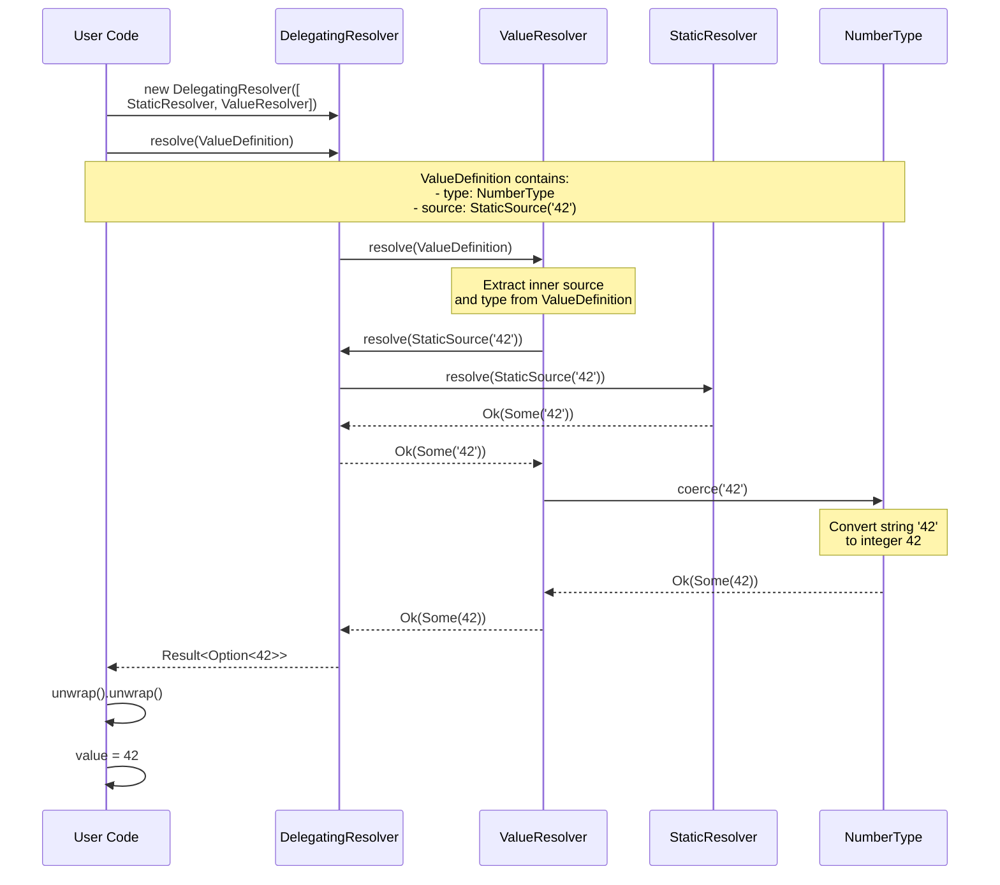
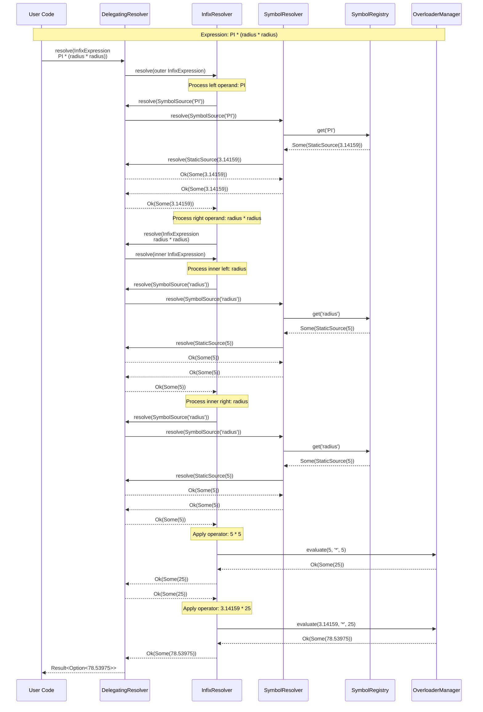
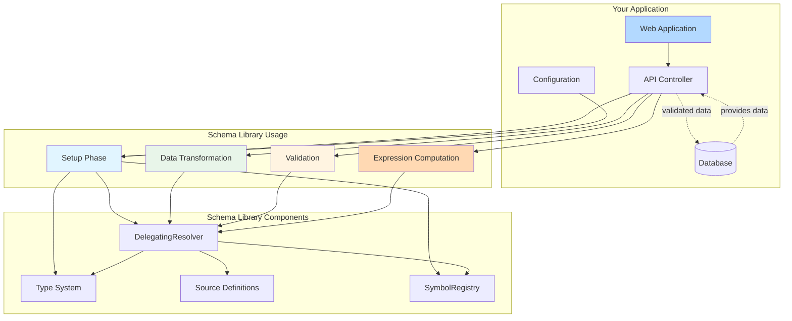
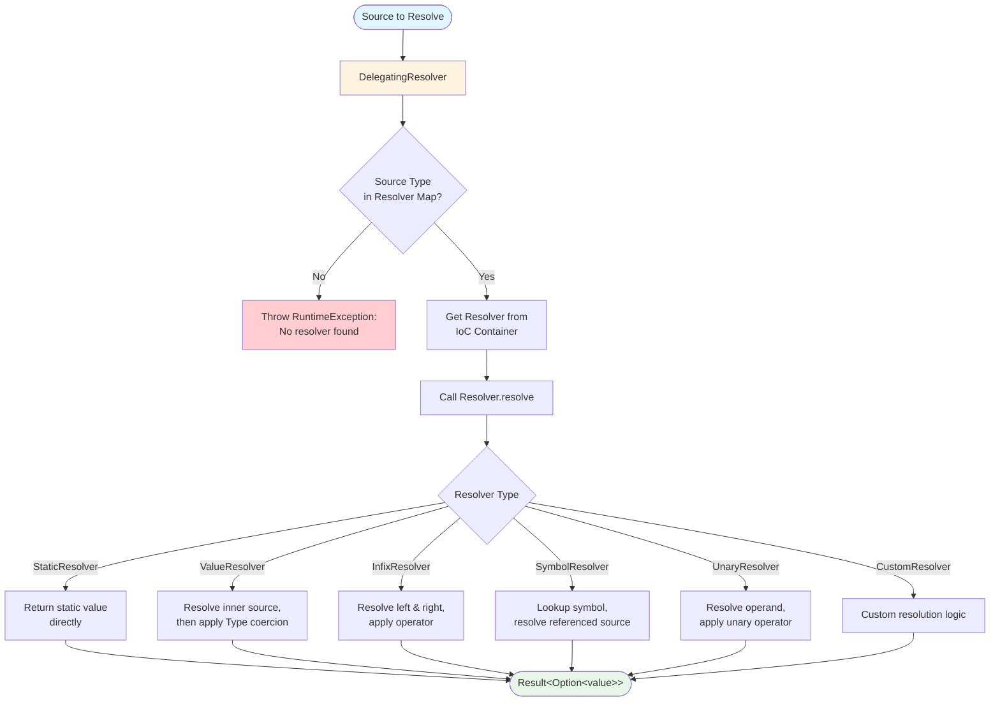
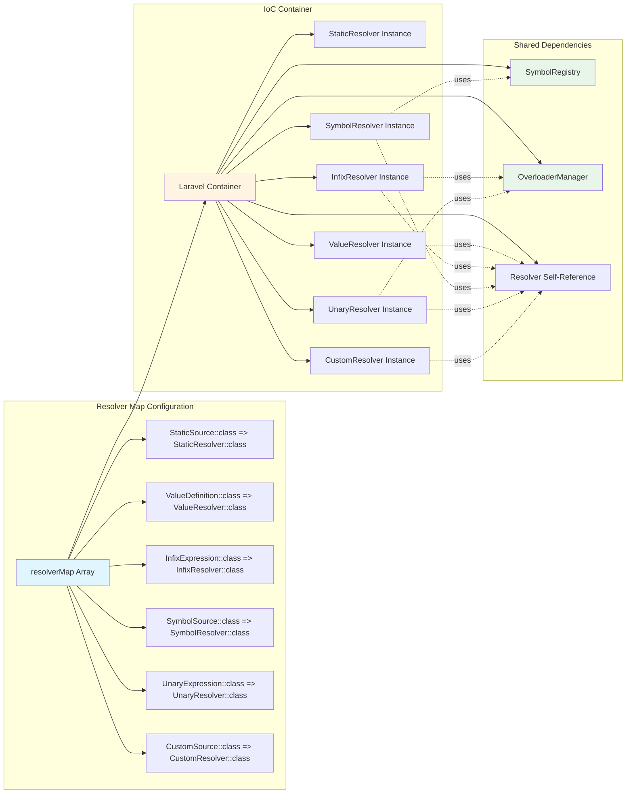
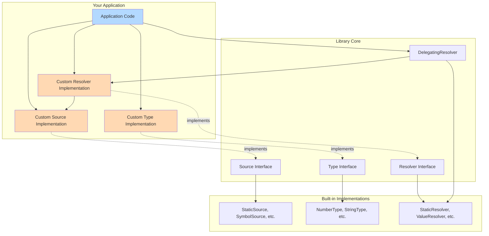
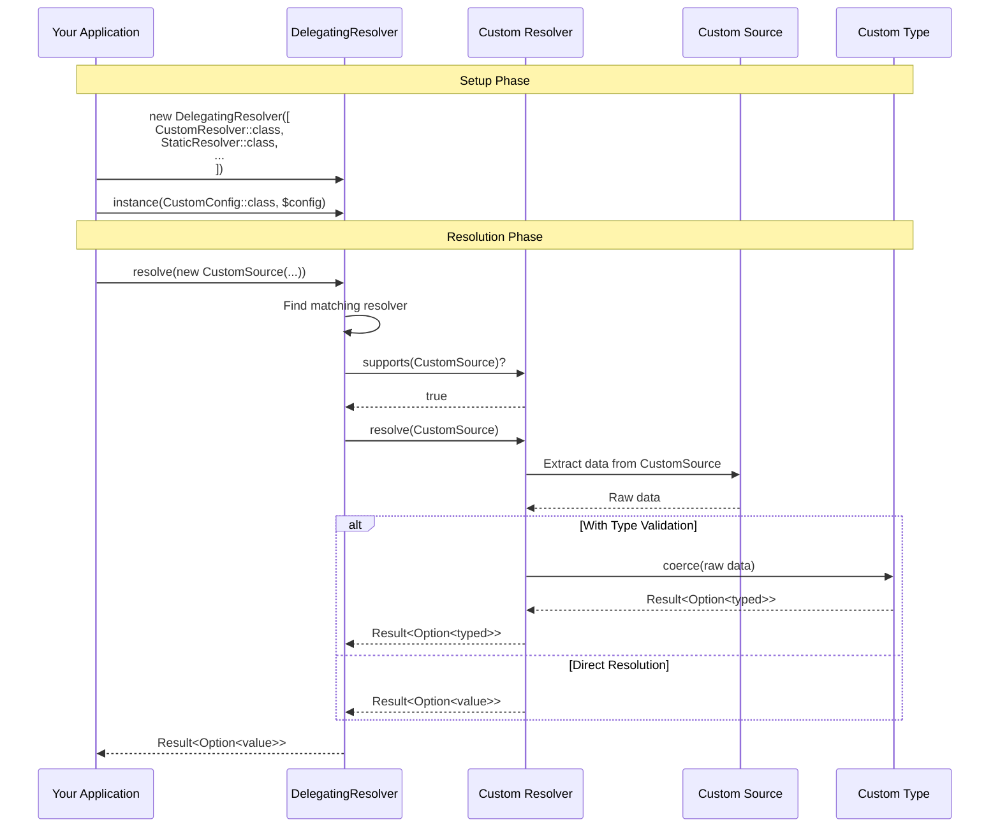
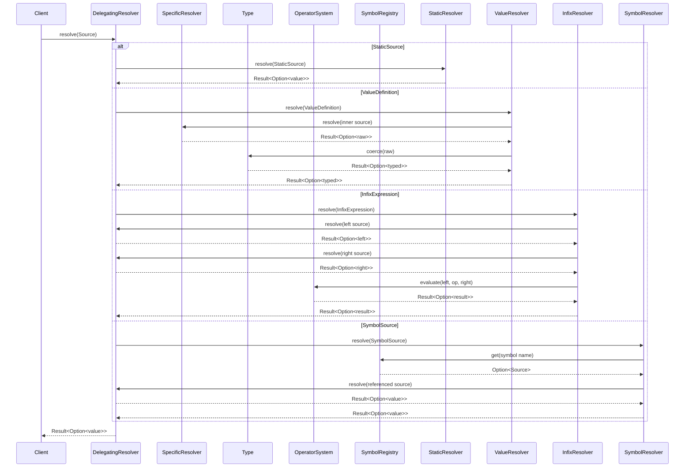
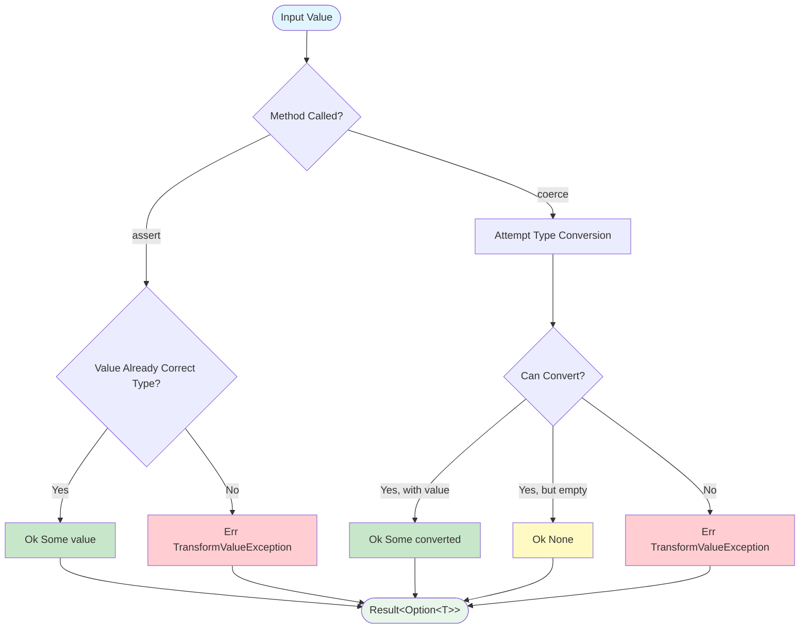

# Schema Library

A powerful PHP library for data transformation, type validation, and expression evaluation. This library provides a flexible framework for defining data schemas, transforming values, and evaluating complex expressions with type safety.

## Features

- **Type System**: Robust type validation and transformation for numbers, strings, booleans, lists, and dictionaries
- **Expression Evaluation**: Support for infix expressions with custom operators
- **Resolver Pattern**: Pluggable resolver system for different data sources
- **Symbol Registry**: Named value resolution and reuse
- **Operator Overloading**: Extensible operator system for custom evaluation logic
- **Monadic Error Handling**: Built on functional programming principles using Result and Option types

## Requirements

- PHP 8.4 or higher
- ext-intl extension

## Installation

```bash
composer require gosuperscript/schema
```

## Quick Start

### Basic Type Transformation

```php
<?php

use Superscript\Schema\Types\NumberType;
use Superscript\Schema\Sources\StaticSource;
use Superscript\Schema\Sources\ValueDefinition;
use Superscript\Schema\Resolvers\DelegatingResolver;
use Superscript\Schema\Resolvers\StaticResolver;
use Superscript\Schema\Resolvers\ValueResolver;

// Create a resolver with basic capabilities
$resolver = new DelegatingResolver([
    StaticResolver::class,
    ValueResolver::class,
]);

// Transform a string to a number
$source = new ValueDefinition(
    type: new NumberType(),
    source: new StaticSource('42')
);

$result = $resolver->resolve($source);
$value = $result->unwrap()->unwrap(); // 42 (as integer)
```

#### Basic Type Transformation Flow



### Expression Evaluation

```php
<?php

use Superscript\Schema\Sources\InfixExpression;
use Superscript\Schema\Sources\StaticSource;
use Superscript\Schema\Sources\SymbolSource;
use Superscript\Schema\SymbolRegistry;
use Superscript\Schema\Resolvers\DelegatingResolver;
use Superscript\Schema\Resolvers\InfixResolver;
use Superscript\Schema\Resolvers\SymbolResolver;

// Set up resolver with symbol support
$resolver = new DelegatingResolver([
    StaticResolver::class,
    InfixResolver::class,
    SymbolResolver::class,
]);

// Register symbols
$resolver->instance(SymbolRegistry::class, new SymbolRegistry([
    'PI' => new StaticSource(3.14159),
    'radius' => new StaticSource(5),
]));

// Calculate: PI * radius * radius (area of circle)
$expression = new InfixExpression(
    left: new SymbolSource('PI'),
    operator: '*',
    right: new InfixExpression(
        left: new SymbolSource('radius'),
        operator: '*',
        right: new SymbolSource('radius')
    )
);

$result = $resolver->resolve($expression);
$area = $result->unwrap()->unwrap(); // ~78.54
```

#### Expression Evaluation Flow



## Core Concepts

### System Integration Example



### Types

The library provides several built-in types for data validation and coercion:

#### NumberType
Validates and coerces values to numeric types (int/float):
- Numeric strings: `"42"` → `42`
- Percentage strings: `"50%"` → `0.5`
- Numbers: `42.5` → `42.5`

#### StringType
Validates and coerces values to strings:
- Numbers: `42` → `"42"`
- Stringable objects: converted to string representation
- Special handling for null and empty values

#### BooleanType
Validates and coerces values to boolean:
- Truthy/falsy evaluation
- String representations: `"true"`, `"false"`

#### ListType and DictType
For collections and associative arrays with nested type validation.

### Type API: Assert vs Coerce

The `Type` interface provides two methods for value processing, following the [@azjezz/psl](https://github.com/azjezz/psl) pattern:

- **`assert(T $value): Result<Option<T>>`** - Validates that a value is already of the correct type
- **`coerce(mixed $value): Result<Option<T>>`** - Attempts to convert a value from any type to the target type

**When to use:**
- Use `assert()` when you expect a value to already be the correct type and want strict validation
- Use `coerce()` when you want to transform values from various input types (permissive conversion)

**Example:**
```php
$numberType = new NumberType();

// Assert - only accepts int/float
$result = $numberType->assert(42);      // Ok(Some(42))
$result = $numberType->assert('42');    // Err(TransformValueException)

// Coerce - converts compatible types
$result = $numberType->coerce(42);      // Ok(Some(42))
$result = $numberType->coerce('42');    // Ok(Some(42))
$result = $numberType->coerce('45%');   // Ok(Some(0.45))
```

Both methods return `Result<Option<T>, Throwable>` where:
- `Ok(Some(value))` - successful validation/coercion with a value
- `Ok(None())` - successful but no value (e.g., empty strings)
- `Err(exception)` - failed validation/coercion

**Note:** The `coerce()` method provides the same functionality as the previous `transform()` method.

### Sources

Sources represent different ways to provide data:

- **StaticSource**: Direct values
- **SymbolSource**: Named references to other sources
- **ValueDefinition**: Combines a type with a source for validation and coercion
- **InfixExpression**: Mathematical/logical expressions
- **UnaryExpression**: Single-operand expressions

### Resolvers

Resolvers handle the evaluation of sources:

- **StaticResolver**: Resolves static values
- **ValueResolver**: Applies type coercion using the `coerce()` method
- **InfixResolver**: Evaluates binary expressions
- **SymbolResolver**: Looks up named symbols
- **DelegatingResolver**: Chains multiple resolvers together

#### Resolver Chain Flow



#### DelegatingResolver Configuration



### Operators

The library supports various operators through the overloader system:

- **Binary**: `+`, `-`, `*`, `/`, `%`, `**`
- **Comparison**: `==`, `!=`, `<`, `<=`, `>`, `>=`
- **Logical**: `&&`, `||`
- **Special**: `has`, `in`, `intersects`

## Advanced Usage

### Composing Custom Sources, Types, and Resolvers

The library is designed to be highly extensible. You can add your own sources, types, and resolvers to the system.



### How Custom Components Integrate



### Custom Types

Implement the `Type` interface to create custom data validations and coercions:

```php
<?php

use Superscript\Schema\Types\Type;
use Superscript\Monads\Result\Result;
use Superscript\Monads\Result\Err;
use Superscript\Schema\Exceptions\TransformValueException;
use function Superscript\Monads\Result\Ok;
use function Superscript\Monads\Option\Some;

class EmailType implements Type
{
    public function assert(mixed $value): Result
    {
        // Strict validation - only accepts valid email strings
        if (is_string($value) && filter_var($value, FILTER_VALIDATE_EMAIL)) {
            return Ok(Some($value));
        }
        
        return new Err(new TransformValueException(type: 'email', value: $value));
    }
    
    public function coerce(mixed $value): Result
    {
        // Permissive conversion - attempts to convert to email format
        $stringValue = is_string($value) ? $value : strval($value);
        $trimmed = trim($stringValue);
        
        if (filter_var($trimmed, FILTER_VALIDATE_EMAIL)) {
            return Ok(Some($trimmed));
        }
        
        return new Err(new TransformValueException(type: 'email', value: $value));
    }
    
    public function compare(mixed $a, mixed $b): bool
    {
        return $a === $b;
    }
    
    public function format(mixed $value): string
    {
        return (string) $value;
    }
}
```

### Custom Resolvers

Create specialized resolvers for specific data sources:

```php
<?php

use Superscript\Schema\Resolvers\Resolver;
use Superscript\Schema\Source;
use Superscript\Monads\Result\Result;

class DatabaseResolver implements Resolver
{
    public function resolve(Source $source): Result
    {
        // Custom resolution logic
        // Connect to database, fetch data, etc.
    }
    
    public static function supports(Source $source): bool
    {
        return $source instanceof DatabaseSource;
    }
}
```

## Development

### Setup

1. Clone the repository
2. Install dependencies: `composer install`
3. Run tests: `composer test`

### Testing

The library uses PHPUnit for testing with 100% code coverage requirements:

```bash
# Run all tests
composer test

# Individual test suites
composer test:unit      # Unit tests
composer test:types     # Static analysis (PHPStan)
composer test:infection # Mutation testing
```

### Code Quality

- **PHPStan**: Level max static analysis
- **Infection**: Mutation testing for test quality
- **Laravel Pint**: Code formatting
- **100% Code Coverage**: Required for all new code

## Architecture

The library follows several design patterns:

- **Strategy Pattern**: Different resolvers for different source types
- **Chain of Responsibility**: DelegatingResolver chains multiple resolvers
- **Factory Pattern**: Type system for creating appropriate transformations
- **Functional Programming**: Extensive use of Result and Option monads

### Package Architecture Overview

```mermaid
graph TB
    subgraph "Core Interfaces"
        Source[Source Interface]
        Type[Type Interface]
        Resolver[Resolver Interface]
    end
    
    subgraph "Source Types"
        StaticSource[StaticSource]
        SymbolSource[SymbolSource]
        ValueDefinition[ValueDefinition]
        InfixExpression[InfixExpression]
        UnaryExpression[UnaryExpression]
    end
    
    subgraph "Type System"
        NumberType[NumberType]
        StringType[StringType]
        BooleanType[BooleanType]
        ListType[ListType]
        DictType[DictType]
    end
    
    subgraph "Resolvers"
        DelegatingResolver[DelegatingResolver]
        StaticResolver[StaticResolver]
        ValueResolver[ValueResolver]
        InfixResolver[InfixResolver]
        UnaryResolver[UnaryResolver]
        SymbolResolver[SymbolResolver]
    end
    
    subgraph "Operator System"
        OverloaderManager[OverloaderManager]
        BinaryOverloader[BinaryOverloader]
        ComparisonOverloader[ComparisonOverloader]
        LogicalOverloader[LogicalOverloader]
    end
    
    subgraph "Support"
        SymbolRegistry[SymbolRegistry]
        Container[IoC Container]
    end
    
    Source --> StaticSource
    Source --> SymbolSource
    Source --> ValueDefinition
    Source --> InfixExpression
    Source --> UnaryExpression
    
    Type --> NumberType
    Type --> StringType
    Type --> BooleanType
    Type --> ListType
    Type --> DictType
    
    Resolver --> DelegatingResolver
    Resolver --> StaticResolver
    Resolver --> ValueResolver
    Resolver --> InfixResolver
    Resolver --> UnaryResolver
    Resolver --> SymbolResolver
    
    DelegatingResolver --> Container
    DelegatingResolver --> StaticResolver
    DelegatingResolver --> ValueResolver
    DelegatingResolver --> InfixResolver
    DelegatingResolver --> UnaryResolver
    DelegatingResolver --> SymbolResolver
    
    ValueDefinition --> Type
    InfixResolver --> OverloaderManager
    UnaryResolver --> OverloaderManager
    SymbolResolver --> SymbolRegistry
    
    OverloaderManager --> BinaryOverloader
    OverloaderManager --> ComparisonOverloader
    OverloaderManager --> LogicalOverloader
    
    style Source fill:#e1f5ff
    style Type fill:#fff4e1
    style Resolver fill:#e8f5e9
```



### Data Flow Through The System



### Type Transformation Flow



## Error Handling

All type validation and coercion operations return `Result<Option<T>, Throwable>` types:

- `Result::Ok(Some(value))`: Successful validation/coercion with value
- `Result::Ok(None())`: Successful validation/coercion with no value (null/empty)
- `Result::Err(exception)`: Validation/coercion failed with error

This approach ensures:
- No exceptions for normal control flow
- Explicit handling of success/failure cases
- Type-safe null handling

## License

Proprietary - See license terms in your agreement.

## Contributing

This is a private library. Please follow the established patterns and ensure all tests pass before submitting changes.